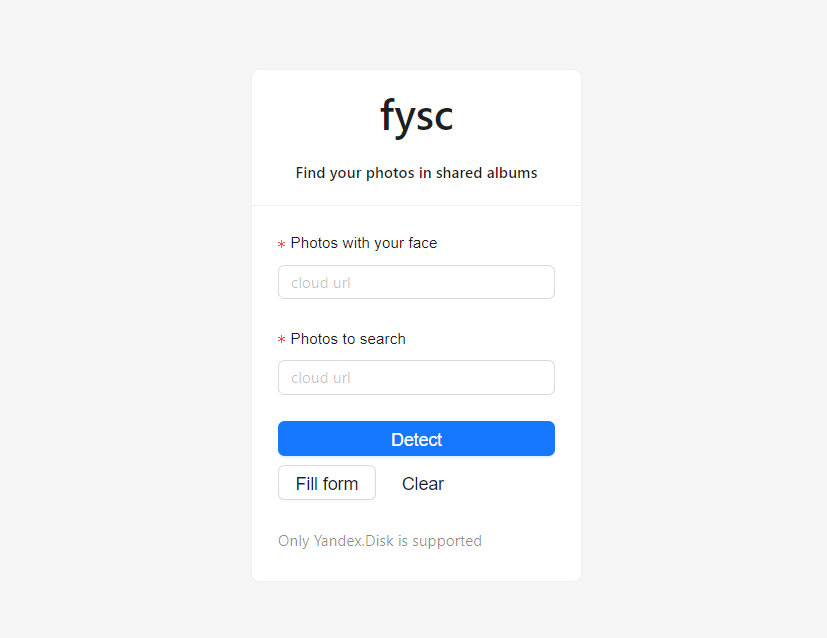

# fysc — Find YourSelf in Clouds

**Find your photos in shared albums.** The goal is to provide simple interface to extract (your) photos from any shared albums. We based our application on [deepface](https://github.com/serengil/deepface/) library.

All you need is:
- put a link to album with your photos
- put a link to album to search into
- click **Detect**
- `.zip` archive with your photos will be downloaded automatically



## Technology Stack

- [deepface](https://github.com/serengil/deepface/)
- React TS
- `fastapi`
- Docker

## Model Comparison

We compared VGG-Face, Facenet512, and SFace on three distance metrics: Cosine similarity, Euclidean, and Euclidean l2.

| Model      | Metric       | Accuracy |
|------------|--------------|----------|
| VGG-Face   | Cosine       | 77.78%   |
| VGG-Face   | Euclidean    | 77.78%   |
| VGG-Face   | Euclidean l2 | 72.22%   |
| Facenet512 | Cosine       | 52.94%   |
| Facenet512 | Euclidean    | 76.47%   |
| Facenet512 | Euclidean l2 | 76.47%   |
| SFace      | Cosine       | 23.53%   |
| SFace      | Euclidean    | 94.12%   |
| SFace      | Euclidean l2 | 17.65%   |

For backend we used recommended setup by deepface, namely:
- Facenet512
- retinaface backend
- Euclidean l2

## Future Work

- YOLOv8

## To Get Started

- Frontend

```shell
cd client
npm i
npm start
```
  
- Backend

```shell
cd server
pip install -r requirements.txt
uvicorn --port 8000 main:app
```
  
